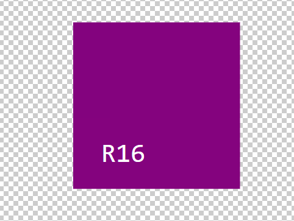
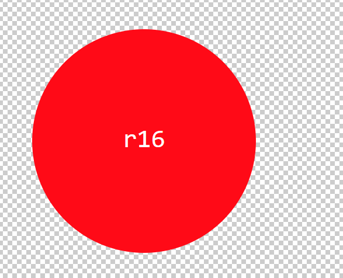

# VisualSpecialist

## Description 
The purpose of [VisualSpecialist](https://github.com/TheR16H/VisualSpecialist) is for people who are in a crunch for time (or just for fun) want to quickly and efficently create a SVG logo. you can paste up to 3 characters on a shape of your choosing (Square, Triangle, or Circle) and then follow up by selecting the color of your choosing either using a hex code or by simply typing in the color name.

## Table of Contents

- [Visuals](#visuals)
- [Usage](#usage)
- [Installation](#installation)
- [Support](#support)
- [Contributions](#contributions)
- [Acknowledgments](#Acknowledgments)
- [License](#license)

## Visuals
 
 
.gif)

## Usage
the intended usage is to quickly and efficently create an SVG image. to start the application run 
```
node index.js
```
in your terminal.
## Installation
just simply run the following command and you're all set! 
```
npm i
```

## Support
For any support (or if you want to see some of my other works) find me on [Github!](https://github.com/TheR16H)

## Contributions
No contributions will be needed for this project.

## Acknowledgments
- [SVG Docs](https://developer.mozilla.org/en-US/docs/Web/SVG/Tutorial/Basic_Shapes)
- [SVG basic shapes](https://developer.mozilla.org/en-US/docs/Web/SVG/Tutorial/Basic_Shapes)
- [SVG VS Code extension](https://marketplace.visualstudio.com/items?itemName=jock.svg)

## License
MIT License

Copyright (c) 2024 Rashawn Hall

Permission is hereby granted, free of charge, to any person obtaining a copy
of this software and associated documentation files (the "Software"), to deal
in the Software without restriction, including without limitation the rights
to use, copy, modify, merge, publish, distribute, sublicense, and/or sell
copies of the Software, and to permit persons to whom the Software is
furnished to do so, subject to the following conditions:

The above copyright notice and this permission notice shall be included in all
copies or substantial portions of the Software.

THE SOFTWARE IS PROVIDED "AS IS", WITHOUT WARRANTY OF ANY KIND, EXPRESS OR
IMPLIED, INCLUDING BUT NOT LIMITED TO THE WARRANTIES OF MERCHANTABILITY,
FITNESS FOR A PARTICULAR PURPOSE AND NONINFRINGEMENT. IN NO EVENT SHALL THE
AUTHORS OR COPYRIGHT HOLDERS BE LIABLE FOR ANY CLAIM, DAMAGES OR OTHER
LIABILITY, WHETHER IN AN ACTION OF CONTRACT, TORT OR OTHERWISE, ARISING FROM,
OUT OF OR IN CONNECTION WITH THE SOFTWARE OR THE USE OR OTHER DEALINGS IN THE
SOFTWARE.
